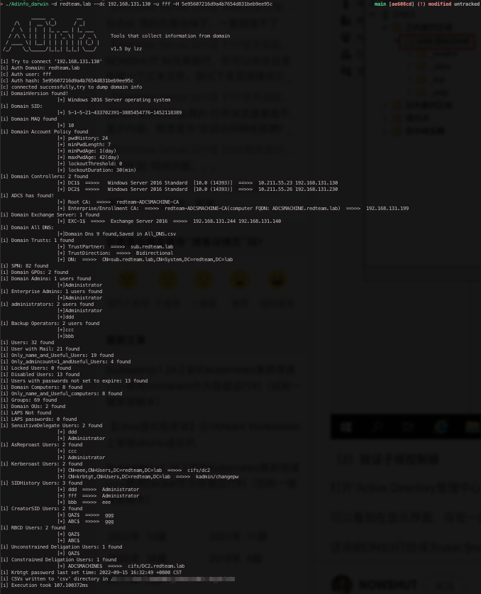
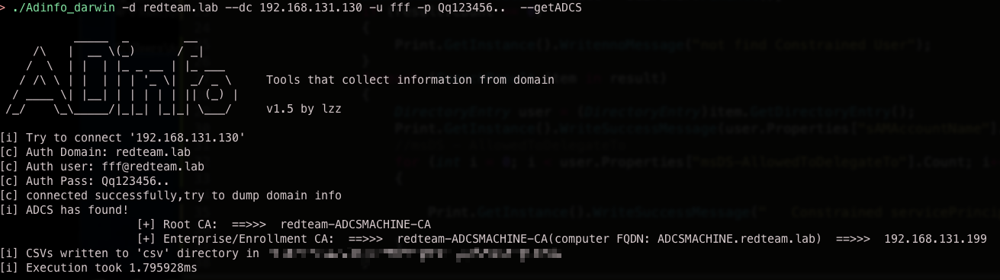
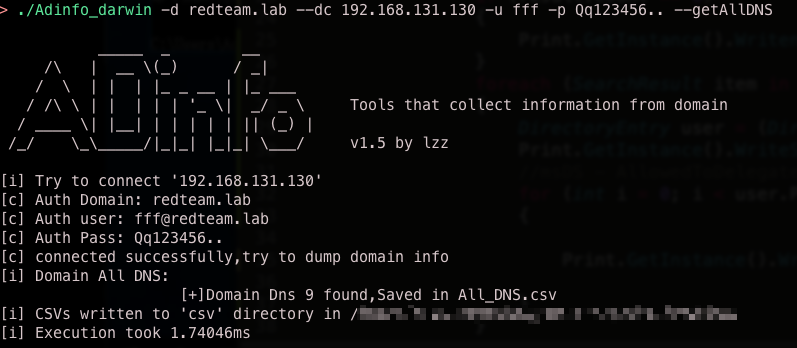
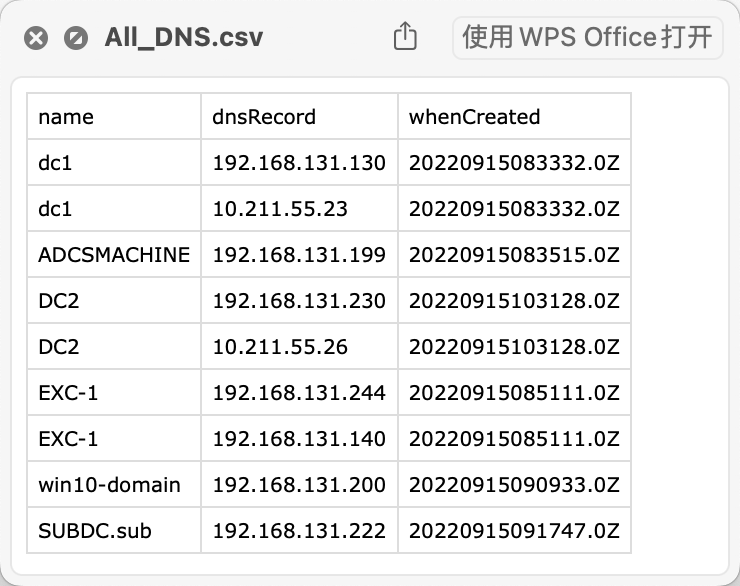
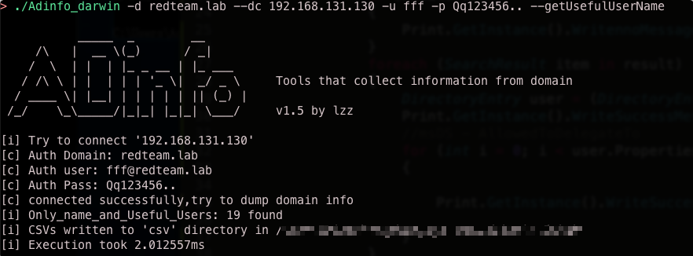

# Adinfo

此为去年实习时依照goddi二开的基于go的ldap查询工具

修复了连接时可能会存在的bug、依照攻防及域信息收集经验dump快而有用的域信息

刚学go的时候写的，能跑就行

### Usage

1.输出所有信息
```
./Adinfo -d redteam.lab --dc 192.168.131.130 -u fff -H 5e95607216d9a4b7654d831beb9ee95c

./Adinfo -d redteam.lab --dc 192.168.131.130 -u fff -p Qq123456..
```


2.当域很大或者目前只需要特定属性的值，可以指定下面的参数进行查询

```
      --getPolicy                get domain Policy
      --getDCandExchangeDNS      get DC and Exchange DNS
      --getAllDNS                get all domain DNS
      --getmaq                   get domain MAQ
      --getdomainVersion         get domain Version
      --getMail                  get domain Mail
      --getSID                   get domain SID
      --getExchangeInformation   get Exchange Information
      --getDomainTrusts          get trusts domain
      --getSPN                   get all SPN
      --getGPO                   get all GPO
      --getDomainAdmins          get all domain admins
      --dclocaladministrators    get dc local administrators
      --BackupOperators          get dc local Backup Operators
      --getDC                    get all DomainControllers
      --getAllUser               get all domain user
      --getUsefulUserName        get all not Disabled and Locked user(only name)
      --getHighlevelUser         get users that admincount=1(only name)
      --getNotusefulUser         get not useful user(Locked or Disabled)
      --getUsersNoExpire         get users not expire
      --getComputers             get all domain computers
      --getComputersName         get all domain computers(only name)
      --getDomainGroup           get all domain group
      --getCreatorSID            get all CreatorSID
      --getADCS                  get ADCS information
      --getOU                    get domain OU
      --checkLAPS                get is have LAPS, If the current user has permission, all LAPS passwords will be exported.
      --checkbackdoor            check backdoor：MAQ、AsReproast、Kerberoast、SIDHistory、GetRBCD、UnconstrainedDeligation、ConstrainedDeligation、SensitiveDelegateAccount
      --Krbtgttime               get Krbtgt password last set time
```

举以下三例说明：

(1).查看域内ADCS信息，并具体的FQDN和ip
```
./Adinfo_darwin -d redteam.lab --dc 192.168.131.130 -u fff -p Qq123456..  --getADCS
```



(2).获取域内所有的DNS信息
```
./Adinfo_darwin -d redteam.lab --dc 192.168.131.130 -u fff -p Qq123456.. --getAllDNS
```




(3).获取域内所有用户名（过滤掉了disabled和Locked user，只输出用户名到Users_OnlyName.csv中，将csv重命名为txt就能对所有有用的域用户进行密码喷洒）
```
./Adinfo_darwin -d redteam.lab --dc 192.168.131.130 -u fff -p Qq123456.. --getUsefulUserName
```



### Todo

1.nTSecurityDescriptor字段解析存在问题，后续再解决

2.添加对ldap增删改操作

### Reference

https://github.com/NetSPI/goddi

https://github.com/kgoins/go-winacl/